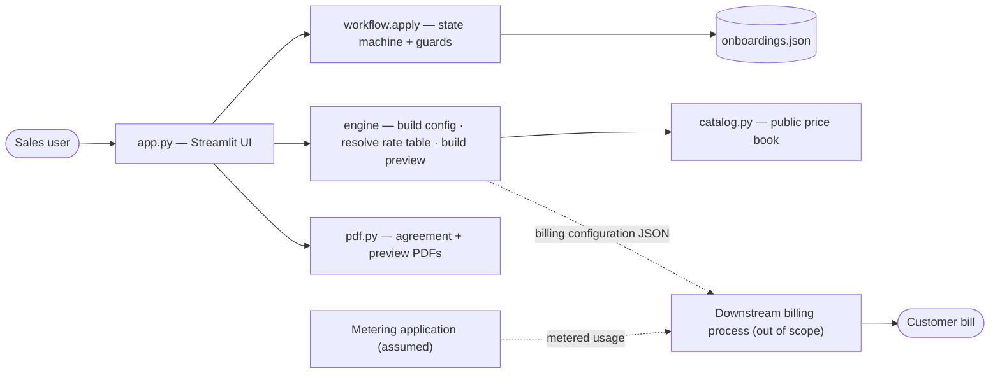
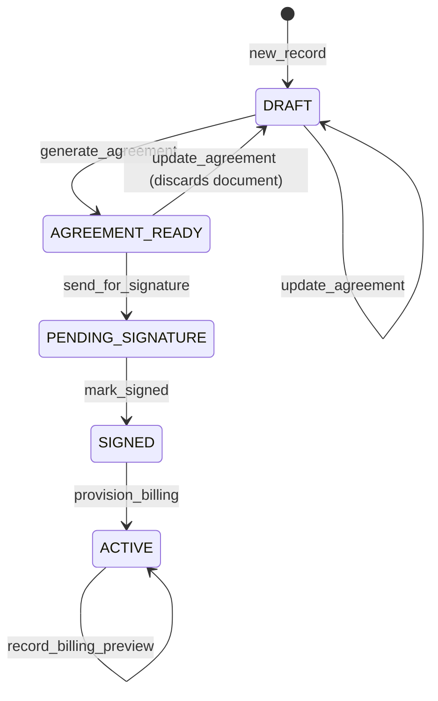

# Requirements — Private Pricing Customer Onboarding

## 1. Problem

Large customers sign committed-spend contracts: a dollar commitment per year in
exchange for negotiated discounts. Getting one of those customers set up to bill
correctly is a hand-off across several steps — agree terms, draft an agreement,
get it signed, translate the negotiated discounts into per-SKU rates the billing
system applies — and each step is done ad hoc in spreadsheets and email. Steps get
skipped. Discounts get entered against the wrong products. The discount definition
drifts from the products it covers. No single record shows where a given customer
is in the process.

This tool is one workflow that carries a customer from a draft agreement to active
billing. Every step is a guarded state transition with an audit trail. The
negotiated discounts are stored as rules that resolve against one shared product
catalog, not as a per-customer price list that has to be maintained by hand.

## 2. Overview

A web tool for a Sales user to onboard a customer onto a private (committed-spend)
pricing agreement and to run that agreement afterward. The user authors the deal
terms, the tool produces a signable agreement PDF, the customer signs (mocked),
the tool compiles a billing configuration, and the user generates a monthly
billing preview from usage.

Assignment theme: **Systems & Reliability** — a workflow tool with an explicit
state machine, guards on every transition, deterministic pure logic, an audit
trail, and no server to run.



## 3. Users

| User | Uses the tool to |
|---|---|
| Sales | Author the agreement, send it for signature, provision billing, generate a billing preview for a customer conversation. |
| Billing team (consumer, not a user of the UI) | Receive the billing configuration JSON produced at provisioning. |

## 4. Vocabulary

| Term | Meaning |
|---|---|
| Private pricing agreement | A committed-spend contract: an annual dollar commitment plus a discount structure. |
| Cross-service discount | A single percentage off list price that applies to every SKU. |
| Service-specific discount (SSD) | A percentage off list price for the SKUs of one service. |
| Attribute-based discounting | A discount rule targets SKUs by a predicate over their attributes (`service_code`, `unit`, `id`, `price_source`), not by a fixed list of SKU ids. See section 8.1. |
| Service code | The stable machine identifier for a service (`CLAUDE_API`, `CLAUDE_CODE`, `CLAUDE_FOR_WORK`, `SERVER_TOOLS`). SSD rules match on this. |
| Catalog | The public product catalog: SKUs with list prices. One catalog for all customers. |
| Billing configuration | The JSON compiled at provisioning. Holds the cross-service percentage and the SSD rules. Does not hold per-SKU prices. |
| Rate table | Per-SKU discount and effective price. Derived from the billing configuration and the current catalog on demand. Never stored. |
| Billing preview | A non-binding cost estimate for one month, computed from hand-entered usage. Not an invoice. |

## 5. Scope

### 5.1 In scope

1. An onboarding tracker listing every onboarding with its status.
2. Agreement authoring: a form for the deal terms.
3. Agreement generation: a one-page PDF from the form.
4. A mock signature action that records a signer name and timestamp.
5. Billing configuration: compile the agreement's discounts into the JSON in section 8.
6. Rate table: resolve the billing configuration against the catalog.
7. Billing preview: one per month, from hand-entered usage, with a PDF.
8. A state machine that governs every transition, with guards.
9. Persistence to one JSON file, surviving process restart.
10. A per-record history log of every transition.
11. Exports: billing configuration JSON, rate table CSV, billing preview PDF, agreement PDF.

### 5.2 Out of scope

1. A live usage-metering feed. Usage is typed in.
2. Real electronic signature. The signature step is a button.
3. Commitment drawdown, minimum-commitment shortfall billing, true-up, overage.
4. Volume tiers, ramp schedules.
5. Per-SKU discount overrides in a contract exhibit.
6. Flat (absolute) negotiated unit prices. Discounts are percentages only.
7. Currencies other than USD.
8. Multiple users, authentication, roles.
9. Tax.
10. Editing the catalog or price book through the UI.

## 6. Assumptions

1. A metering application exists and measures each customer's usage per SKU per
   billing period. This tool does not meter usage. The billing configuration it
   produces (section 8) is the input a downstream billing process uses, together
   with metered usage, to compute the customer's bill: for each SKU,
   `charge = metered_quantity × list_price × (1 − discount_pct / 100)`, with
   `discount_pct` resolved from the configuration.
2. The billing preview in this tool stands in for that downstream calculation
   using hand-entered quantities. It is an estimate, not the bill.
3. The public catalog and its list prices are maintained elsewhere and are
   current. This tool reads them.
4. Agreement terms are negotiated and internally approved before a user enters
   them here. This tool records terms; it does not run deal approval.
5. One account number identifies one customer billing account. A configuration's
   discounts apply to that account.

## 7. State machine

Statuses: `DRAFT`, `AGREEMENT_READY`, `PENDING_SIGNATURE`, `SIGNED`, `ACTIVE`.



| Action | From | To | Guard |
|---|---|---|---|
| `generate_agreement` | `DRAFT` | `AGREEMENT_READY` | Agreement passes validation. |
| `send_for_signature` | `AGREEMENT_READY` | `PENDING_SIGNATURE` | A document was generated. |
| `mark_signed` | `PENDING_SIGNATURE` | `SIGNED` | — |
| `provision_billing` | `SIGNED` | `ACTIVE` | Account number is present. |
| `update_agreement` | `DRAFT`, `AGREEMENT_READY` | `DRAFT` | Not allowed once sent for signature. From `AGREEMENT_READY` it discards the generated document. |
| `record_billing_preview` | `ACTIVE` | `ACTIVE` | Billing month is `YYYY-MM`; usage has at least one positive quantity. |

`apply(record, action, payload)` is the only function that changes a record. It
deep-copies the record, checks the transition is legal, runs the guard, applies
the change, appends a `history` entry, and returns the new record. It performs no
file or network I/O.

Every transition appends `{ at, action, from, to }` to `history`. An
`update_agreement` from `AGREEMENT_READY` also appends `{ action: "revise" }`. A
`record_billing_preview` appends `note` set to the billing month.

## 8. Billing configuration

`provision_billing` writes this JSON to `record.billing_config`:

```jsonc
{
  "kind": "private-pricing-billing-config",
  "version": "1.0",
  "onboarding_ref": "ONB-XXXXXXXX",
  "account_number": "GLBX-004417",
  "customer": { "company_name": "...", "signer_name": "..." },
  "currency": "USD",
  "billing": "monthly in arrears",
  "effective_from": "2026-09-05",
  "effective_to": "2027-09-04",
  "annual_committed_spend_usd": 5000000.0,
  "price_book_date": "2026-08-01",
  "provisioned_at": "2026-09-07T17:42:41+00:00",
  "cross_service_discount_pct": 12,          // integer, or null when the model has no cross-service part
  "discount_rules": [                        // one per per-service row; empty when the model is cross_service
    {
      "id": "ssd-claude-code",
      "type": "service_specific_discount",
      "description": "Claude Code service discount",
      "discount_pct": 20,
      "match": { "all": [ { "field": "service_code", "op": "eq", "value": "CLAUDE_CODE" } ] }
    }
  ]
}
```

### 8.1 Match expressions — attribute-based discounting

A discount rule does not carry a list of SKU ids. It carries a `match`
expression — a predicate over a SKU's attributes. To apply a rule, the resolver
evaluates its `match` against every SKU in the catalog and keeps the SKUs for
which it returns true. Those SKUs get the rule's `discount_pct`. This is
attribute-based discounting: the discount is defined by what a product *is*, not
by an enumerated list. A SKU added to the catalog later is covered by any rule
whose `match` it satisfies, with no change to the configuration.

Grammar:

- Leaf: `{ "field": F, "op": OP, "value": V }`. `F` is one of `service_code`,
  `id`, `unit`, `price_source`. `OP` is `eq` or `in`. For `in`, `V` is a list.
- Combinator: `{ "all": [ expr, ... ] }` (AND) or `{ "any": [ expr, ... ] }` (OR).
- An unknown field or op is an error.

Example. This rule:

```json
{
  "id": "ssd-claude-api",
  "discount_pct": 20,
  "match": { "all": [ { "field": "service_code", "op": "eq", "value": "CLAUDE_API" } ] }
}
```

evaluated against the catalog in section 9:

| SKU | `service_code` | `match` result | Discount applied |
|---|---|---|---|
| `API-OPUS-5-INPUT` | `CLAUDE_API` | true | 20% |
| `API-OPUS-5-OUTPUT` | `CLAUDE_API` | true | 20% |
| `CLAUDE-CODE-USAGE` | `CLAUDE_CODE` | false | — |
| `CLAUDE-ENTERPRISE-SEAT` | `CLAUDE_FOR_WORK` | false | — |
| `TOOL-WEB-SEARCH` | `SERVER_TOOLS` | false | — |

The rule filters the catalog to the two Claude API SKUs; the 20% applies to
those. The other three fall through to the cross-service discount, or to list
price if there is none (section 8.2).

A combinator narrows or widens the filter. `{ "any": [ { "field":
"service_code", "op": "eq", "value": "CLAUDE_CODE" }, { "field": "unit", "op":
"eq", "value": "per_seat_month" } ] }` matches `CLAUDE-CODE-USAGE` and
`CLAUDE-ENTERPRISE-SEAT`.

**Why this scales.** One rule covers as many SKUs as share the attribute — every
Claude API token line, cache line, and batch line, plus every model added later,
from a single rule. A new SKU is discounted the moment it enters the catalog with
a matching attribute; no per-customer edit. The billing configuration holds a
fixed handful of rules whatever the catalog size, so it does not grow or drift as
the product set does. Widening a discount to a whole unit type
(`unit == per_mtok`) or price class (`price_source == public`) is the same one
rule, not a longer list.

**Alternative considered and rejected.** Give each customer their own SKUs at
negotiated rates — a private price list per account. This does not scale: every
customer multiplies the SKU set, the same product exists many times under
different ids, and a list-price or catalog change has to be re-applied to every
private copy. Attribute-based rules keep one shared catalog and a small rule set
per customer instead.

### 8.2 Resolution

For each SKU in the catalog:

1. Evaluate `discount_rules` in order. The first rule whose `match` is satisfied
   applies its `discount_pct`; record its `id` as the applied rule.
2. If no rule matched and `cross_service_discount_pct` is set, apply it; record the
   applied rule as `cross_service`.
3. Otherwise the SKU bills at list price; the applied rule is null.

`effective_price = round(list_price × (1 − pct/100), 4)` for `per_mtok` SKUs,
2 decimals otherwise.

The rate table is `{ lines: [...], summary: { skus_total, skus_discounted,
skus_at_list, skus_at_list_ids } }`. It is computed on request. It is not written
to the record or the store.

## 9. Catalog

Five SKUs, one per service area:

| id | service_code | unit | list_price |
|---|---|---|---|
| `API-OPUS-5-INPUT` | `CLAUDE_API` | per_mtok | 5.00 |
| `API-OPUS-5-OUTPUT` | `CLAUDE_API` | per_mtok | 25.00 |
| `CLAUDE-CODE-USAGE` | `CLAUDE_CODE` | per_mtok | 6.00 |
| `CLAUDE-ENTERPRISE-SEAT` | `CLAUDE_FOR_WORK` | per_seat_month | 60.00 |
| `TOOL-WEB-SEARCH` | `SERVER_TOOLS` | per_1k_calls | 10.00 |

`price_book_date = 2026-08-01`. `CLAUDE-CODE-USAGE`, `CLAUDE-ENTERPRISE-SEAT`, and
`TOOL-WEB-SEARCH` list prices are illustrative; the Opus prices are public.

## 10. Non-functional requirements

1. **Stack**: Python 3.11 or later, Streamlit, `fpdf2`. No other runtime
   dependency.
2. **No backend**: no server process of its own, no database, no authentication.
3. **Persistence**: one JSON file, `data/onboardings.json`, holding a map of
   record id to record. Writes are atomic (write a temp file, rename over the
   target). The file is not committed.
4. **Purity**: `workflow.py` and `engine.py` import no Streamlit and perform no
   file or network I/O. They are covered by `unittest` with no third-party test
   dependency.
5. **Determinism**: amounts round to 2 decimals; `per_mtok` effective unit prices
   round to 4. The screen, the JSON, and the CSV show the same numbers.
6. **Timestamps**: ISO 8601, UTC, second precision.
7. **Run**: `pip install -r requirements.txt` then `streamlit run app.py`.
8. **Deploy**: the repository runs on Streamlit Community Cloud with no change.
